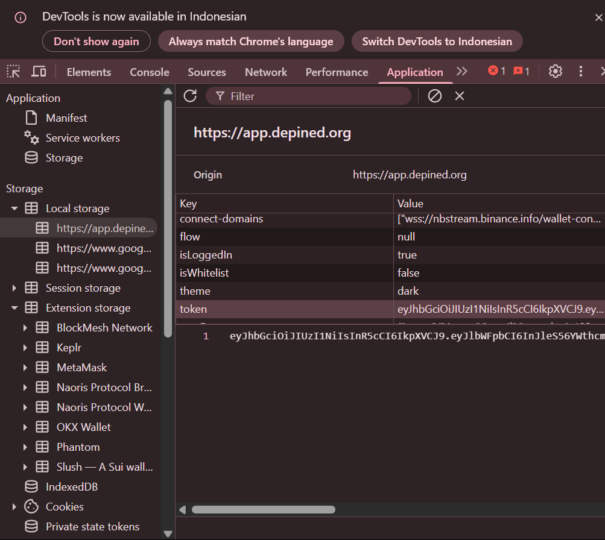

# DePINed BOT
DePINed BOT

- Register Here : [DePINed](https://app.depined.org/onboarding)
- Use Code `DEKdbAvtvF4DeX`

## Features

  - Auto Get Account Information
  - Auto Run With [Free Proxyscrape](https://proxyscrape.com/free-proxy-list) Proxy - `Choose 1`
  - Auto Run With Private Proxy - `Choose 2`
  - Auto Run Without Proxy - `Choose 3`
  - Auto Rotate Invalid Proxies - `y` or `n`
  - Auto Send Ping Every 90 seconds
  - Multi Accounts With Threads

## Requiremnets

- Make sure you have Python3.9 or higher installed and pip.
- 2captcha key (optional)

## Instalation

1. **Clone The Repositories:**
   ```bash
   git clone https://github.com/DropsterMind/DePINed-AUTO.git
   ```
   ```bash
   cd DePINed-AUTO
   ```

2. **Install Requirements:**
   ```bash
   pip install -r requirements.txt #or pip3 install -r requirements.txt
   ```

## Configuration

- **2captcha_key.txt:** You will find the file `2captcha_key.txt` inside the project directory. Make sure `2captcha_key.txt` contains data that matches the format expected by the script. Here are examples of file formats:
  ```bash
    your_2captcha_key
  ```

- **accounts.json:** You will find the file `accounts.json` inside the project directory. Make sure `accounts.json` contains data that matches the format expected by the script. Here are examples of file formats:
  ```json
    [
        {
            "Email": "your_email_address_1",
            "Password": "your_password_1"
        },
        {
            "Email": "your_email_address_2",
            "Password": "your_password_2"
        }
    ]
  ```

### Note

- If you don't have a 2cpatcha key, you can fetch the data manually and put it in tokens.json according to the format.

<div style="text-align: center;">
  
</div>
  
- **tokens.json:** You will find the file `tokens.json` inside the project directory. Make sure `tokens.json` contains data that matches the format expected by the script. Here are examples of file formats:
  ```json
    [
        {
            "Email": "your_email_address_1",
            "accessToken": "your_access_token_1"
        },
        {
            "Email": "your_email_address_2",
            "accessToken": "your_access_token_2"
        }
    ]
  ```

- **proxy.txt:** You will find the file `proxy.txt` inside the project directory. Make sure `proxy.txt` contains data that matches the format expected by the script. Here are examples of file formats:
  ```bash
    ip:port # Default Protcol HTTP.
    protocol://ip:port
    protocol://user:pass@ip:port
  ```

## Setup

```bash
python setup.py #or python3 setup.py
```

## Run

```bash
python bot.py #or python3 bot.py
```

## ☕ Buy Me a Coffee

If you find this project helpful, consider supporting me through crypto tips:

- **EVM:** 0x8AD937497B71913167295202d242de4d9FeE3934

- **TON:** UQCTmU0xhlyy077Mdr9R0UAfw529XAVzi76QSYksGzhf6Z6U

- **SOL:** 7WJHZn59gUHtF6bNVQLi5XL37Ni2zvUYA2M7kskkpzu8

- **SUI:** 0xdf86f613edb2c75b325922ff81fc5c13e0aff7a7d788f68611ff82f9a667dc47

🙏 Thanks for checking out this repository!
Don’t forget to star ⭐ and follow if you find it useful.
If you encounter issues, have questions, or want to suggest improvements — feel free to reach out or open an issue right here.

**DropsterMind 🧠**
